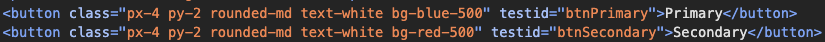
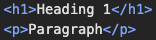

# @stylewind

Create components with [tailwindcss](https://github.com/tailwindlabs/tailwindcss) easily and quickly :)

Inspired by [styled-components](https://github.com/styled-components/styled-components).

## Installation

@stylewind is available as an [npm package](https://www.npmjs.com/package/@stylewind/core).

npm:

```bash
npm i @stylewind/core
```

## Settings

1. Install vscode [Tailwind CSS IntelliSense](https://marketplace.visualstudio.com/items?itemName=bradlc.vscode-tailwindcss) extension;
2. Add the code below to the vscode settings file at the root of your project (`~/.vscode/settings.json`):

```json
{
  "tailwindCSS.experimental.classRegex": [
    "(?:stw|stylewind)(?:\\.[\\w.]+)?(?:[\\(<][\\s\\S]*?[\\)>])?(?:`|e \\${)([\\s\\S]*?)(?:`|\\${)",
    "css`([^`]*)`"
  ]
}
```

## How to use stylewind / stw function

Creation:

```tsx
import { stw } from "@stylewind/core";
// or
// import { stylewind } from "@stylewind/core";

const Button = stw.button`
  border
  border-gray-400
  px-4
  py-2
  rounded-md
`;

const ButtonBlue = stw(Button)`
  bg-blue-500
  text-white
`;

const ButtonRed = stw(ButtonBlue)`
  bg-red-500
`;
```

Usage:

```tsx
<>
  <Button>Button</Button>
  <ButtonBlue>Button Blue</ButtonBlue>
  <ButtonRed>Button Red</ButtonRed>
</>
```

Result:


### Custom props

@stylewind supports custom properties in your component.

By default, invalid properties are filtered out from being rendered in the DOM, avoiding console errors.

But if you need a property to be rendered in the DOM, or prevent it from being rendered, use `.withConfig({ shouldProps: [...] })`.

Creation:

```tsx
const Btn = stw.button.withConfig<{
  color?: "primary" | "secondary";
  testid?: string;
}>({
  shouldProps: {
    forward: ['testid'],
    notForward: ['color'],
  }
})`
  px-4
  py-2
  rounded-md
  text-white
  
  ${({ color }) => (color === "secondary" ? "bg-red-500" : "bg-blue-500")}
`;
```

Usage:

```tsx
<>
  <Btn testid="btnPrimary">Primary</Btn>
  <Btn testid="btnSecondary" color="secondary">
    Secondary
  </Btn>
</>
```

Result:


DOM:



## How to use css function

Creation:

```tsx
import { stw, css } from "@stylewind/core";

const common = css`
  px-6
  py-2.5
  rounded-3xl
  text-white
`;

const MaterialBtn = stw('button')<{
  variation: 'elevated' | 'outlined' | 'icon';
}>`
  font-medium
  h-10
  text-sm
  
  ${({ variation }) =>
    ({
      elevated: css`
        ${common}
        bg-blue-500
        shadow
        shadow-gray-500
      `,
      outlined: css`
        ${common}
        bg-red-500
        border
        border-black
      `,
      icon: css`
        bg-green-500
        p-2
        rounded-full
        w-10
      `
    }[variation])}
`;
```


Usage:

```tsx
<>
  <MaterialBtn variation="elevated">Elevated</MaterialBtn>
  <MaterialBtn variation="outlined">Outlined</MaterialBtn>
  <MaterialBtn variation="icon">X</MaterialBtn>
</>
```

Result:


## Property "as"

With the "as" property it is possible to customize the tag that will be rendered in the DOM. No configuration required.

Creation:

```tsx
const Text = stw.span`
  ...
`;
```

Usage:

```tsx
<>
  <Text as="h1">Heading 1</Text>
  <Text as="p">Paragraph</Text>
</>
```

Result:



## License

This project is licensed under the terms of the [MIT license](https://github.com/jonatasge/stylewind/blob/main/LICENSE).
